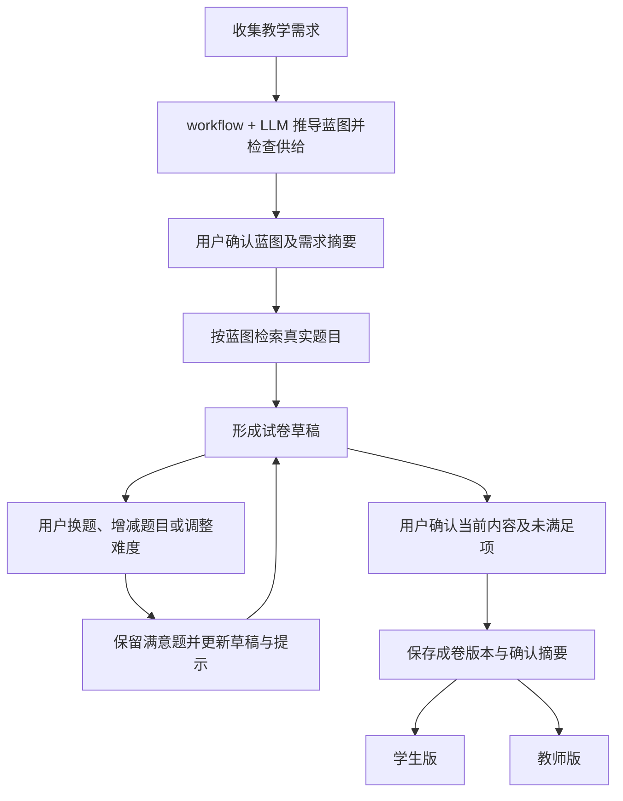
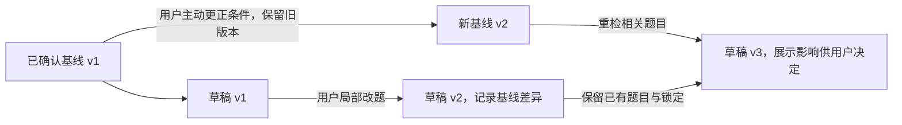

# ADR-0001：教师组卷 workflow

- 状态：已采纳（2026-10-10）；记录设计决策，不表示功能已实现。
- 创建与更新日期：2026-10-10。
- 适用项目：Tutor v1，从零设计。
- 后续依赖：ADR-0002「题库与蓝图详细设计」，计划中。

## 要解决的问题

教师或私教（下文统称用户）需要为具体教学任务准备一份愿意继续调整、打印并实际使用的试卷。用户能够判断题目是否合适，但寻找候选、组织整卷和反复修改需要投入工作。

本 ADR 的核心问题是：**如何将用户的教学意图转化为可用试卷草稿，让用户通过少量局部调整完成交付，同时保留满意题目和最终决定权？**

蓝图、LLM、标签与 workflow 都是实现手段。方案是否成立，取决于它们能否帮助用户完成上述任务；功能齐全或流程走通本身不能证明教学适配与效率收益。

## 从目标推导出的必要职责

| 必须回答的问题 | 本 ADR 确定的原则 |
| --- | --- |
| 用户提供什么，系统才能开始？ | 收集足以指导选题的教学意图，包括本次范围的章节或知识点选择，利用可见预设与必要澄清，避免要求用户先完成整份组卷设计 |
| 系统替用户承担什么？ | 将意图分解为选题计划，从题库搜索和组织真实题目，形成可以继续编辑的草稿 |
| 用户怎样修正结果？ | 换题、增减某类题目和调整难度，保留无关的满意题，最终以用户决定为准 |
| 无法满足需求时怎么办？ | 说明缺少什么、为什么不能完成以及可选处理方式，保留已有成果与继续调整的路径 |

首版服务单个用户，覆盖需求到学生版、教师版交付。多人协作与同一组卷在两个浏览器 Tab 同时编辑不在范围内。先用一个明确的真实教学任务验证端到端可用性，具体学科、范围和试点任务在验证时选定，不要求同时完成所有教学场景。

## 决策：以蓝图衔接意图与选题，围绕草稿进行有限调整

蓝图的职责是把整卷意图分解为可执行、可检查的选题任务，用于指导检索与局部调整。它不能用计划题数代替实际选题，也不能用目标安排代替已证实覆盖。如果蓝图不能有效指导检索，或者用户仍需大量重做，应根据验证结果调整方案。

这些环节不要求对应多个页面。确认蓝图后进入检索与组装，不再确认“开始搜索”；局部修改不反复确认整份蓝图。自然语言建议先展示作用范围，由用户应用；直接界面操作本身表达对应授权。

### 人、LLM 与程序的分工

| 参与者 | 负责的事情 |
| --- | --- |
| 用户 | 表达教学意图，确认初始计划，决定题目取舍与最终交付内容 |
| LLM | 整理需求、推导蓝图、提出有限调整建议，依据已确认信息与可用证据提供适配提示 |
| 程序 | 检索与组织题目，保持修改范围、内容、统计及保存和输出一致，回显真实执行结果 |

系统不替用户最终确认试卷，不静默放宽要求或修改整卷，不以自动生成新题补足题库供给。

### 保留已确认条件，允许用户决定实际结果

整卷范围、已学边界、教学场景和考试规格确认后保存为基线版本，系统不擅自改写。用户换题、增减或调难度造成实际内容偏离基线时，以实际修改为准，通过派生草稿记录差异，保留原确认信息，不强迫补回原计划。

用户主动更正当前任务的条件时，以更正内容形成新基线版本，原基线和更正记录保留；按新版本重检已选题目，展示受影响项并保留已有题目与锁定，由用户决定换题、删除或保留。不要求从零组卷。用户也可主动发起另一组卷任务，另建需求与蓝图；采用哪条路径由用户选择，不由系统猜测是否“填错”。

局部调整保留无关题目与锁定；锁定防止自动换题，用户仍可直接决定修改该题。多个独立操作分别保留成功结果，未完成项说明原因并提供处理方式，不要求用户重做成功项。具体版本与执行合同由后续设计确定。

### 提示风险与未知，保持流程可用

风险基于本次已确认的信息与可用证据判断；信息未确认或依据不足的部分标为未知。用户保留一道题不等于题目已经验证，也不把未知计为证实覆盖。

workflow + LLM 不设阻断级，不因适配判断或标签不充分拒绝用户继续调整，不要求逐题全审或逐项接受未知。供给不足时可以展示标明差异的备选，由用户选择；确实无法满足当前需求时明确告知原因，不反复引导无效重试。

题面、素材、保存或输出不可用时准确说明当前无法完成的部分，保留可用内容与处理入口，不虚构成功。无阻断级不意味着系统能够保证任何需求都可交付。

缺题面的题目不阻止用户确认当前内容：由用户决定替换、删除或接受。用户接受时，该输出明确标为未完整输出，题面缺失的占位不计入已交付的可用题数或证实覆盖；在确认摘要和输出对应位置标明缺失，不将确认成功表述为已经交付完整可用试卷。具体呈现由 ADR-0002 细化。

### 交付用户实际确认的内容

成卷保存用户确认的内容版本和当时展示的摘要，包含基线差异、风险、未知、缺题面题目、未满足项来源与教师版缺项；简要决策记录支持回看，不增加用户填写或审批。交付不能静默换成另一份题目内容。

学生版与教师版使用相同题目顺序，学生版不携带答案和教师内部记录。教师版答案或解析缺失如实显示，不编造；普通组卷不以全部能力、素养、答案解析标签齐全为统一前提。后续修改从成卷版本建立新草稿。

## 方案成立的前提、后续问题与可解程度

以下是实现本方案必须处理的依赖，**不是本 ADR 已经证明成立的能力**。当前文档没有提供实际题库供给、匹配质量或教师接受程度的验证结果。

| 必须解决的问题 | 可解程度与限制 | 后续需要的证据或设计 |
| --- | --- | --- |
| 教学意图能否清楚表达 | 可以从有限场景、预设与局部澄清开始；不能假定任意描述都能准确理解 | 用真实需求核对蓝图是否符合用户原意；需要时拆出快速需求收集 ADR |
| 题库是否有足够可用题目 | 有条件可解，取决于实际供给；workflow 不能创造不存在的候选 | 对选定范围实际检索，核查题面、素材、题型及可替换候选；由 ADR-0002 定义读取合同 |
| 蓝图能否转化为实际选题 | 结构和数量匹配可以工程实现；教学任务匹配依赖题目证据与标签质量 | 定义蓝图与题目匹配关系，检查实际选题并由用户判断可接受性 |
| 难度、解法依赖与风险能否判断 | 可以辅助判断，但不能保证模型判断准确或所有依赖完备 | 用真实题目核对依据；缺少标签不等于不符合，未知不当作通过，模型难度不当作实测结果 |
| 局部修改能否保留成果 | 属于可以明确实现与验证的工程问题 | 定义题目身份、题组粒度、草稿版本与修改范围，验证无关题不被改动、独立成功项不丢失 |
| 能否稳定交付可用试卷 | 工程上可实现，依赖内容、素材、题组关系与输出能力 | 实际预览、打印并核对两个输出版本，定义保存与交付一致性 |

主考范围回答主要考什么，已学边界回答解题允许使用什么，两者分别由用户选择章节或知识点确认。界面可预填上次选择，但须经用户确认本次适用，不默认沿用或擅自猜测教学进度。高中组卷注入初中前置知识，高中部分按用户确认的章节、知识点展开已定义依赖；这表达本次课程前提，不证明学生个体已经掌握。具体基础集合、教材映射与依赖合同由 ADR-0002 处理，不要求用户逐项确认初中知识。

结构、保存与输出等工程能力可以按明确规则验证；题库供给、教学匹配与用户接受程度必须通过实际任务验证。不能用“技术上能实现”替代“已经能帮助用户”。

## 接受的代价与未采用方案

| 方案或取舍 | 理由与代价 |
| --- | --- |
| 采用蓝图连接需求与选题 | 便于解释任务与局部修改，但增加规划环节；其价值须通过实际检索和用户使用验证 |
| 不采用每次整卷重新生成 | 保留满意题目，代价是需要管理局部状态与草稿版本 |
| 不采用 LLM 自动决定成卷 | 保留用户决定权，用户仍承担教学取舍，系统不承诺全自动质量保证 |
| 不采用全题审批或未知逐项放行 | 减少操作负担，代价是无法以审阅手续证明每道题都正确；依靠真实提示、用户选择与确认摘要记录 |

首版不承诺任意需求都有题、自动准确判断所有题目难度、保证绝不超纲或证明学生成绩提升。不建设题库管理、学生作答闭环、实测难度校准、自动改写题干或通用 Agent 平台。

## 验证路径与后续工作边界

1. 选择一个明确的真实教学任务，记录用户希望得到的试卷与本次采用的课程前提。
2. 检查现有题库是否支持该任务，识别最少需要的输入、供给和证据；供给不成立时先处理数据或收窄验证任务。
3. 跑通需求、蓝图、草稿、局部调整与实际交付，让用户判断是否愿意使用，以及需要重做哪些部分。
4. 依据真实困难决定完善题库、蓝图、需求收集或交互，不以增加更多审批和异常规则代替解决问题。

MVP 的必要验证是：用户能完成一次可接受的组卷，能够局部修正结果且保留满意题，输出与最终确认内容一致；无法满足时得到明确原因与可行选择。蓝图无法指导检索、用户必须大量重做或输出不可用，均是需要调整方案的证据。效率基线、试点人数与比较方法待 MVP 后决定，不预填效果数据。

ADR-0002 负责题库与蓝图的详细合同，包括最少可用信息、匹配依据、题组、知识前置依赖、草稿和版本一致性。检索实现、异步操作、字段、异常回显、摘要与历史保存细节进入详细设计和开发任务；这里不提前固定页面与状态枚举，也不表示相关设计已完成。

仅当出现新的重要方案取舍时新增专题 ADR。评审本 ADR 时，重点判断核心问题、职责分工、流程选择、成立前提及验证路径是否合理；不要求在采纳前穷尽全部实现和边缘情况。

下一阶段按[题库与蓝图设计任务清单](../tasks/phase-02-question-bank-blueprint.md)推进，任务完成状态与设计采纳状态分别记录。
