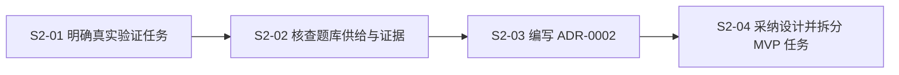

# 下一阶段：题库与蓝图设计

- 状态：待开始；本清单不表示任务已完成。
- 创建日期：2026-10-10。
- 依据：[ADR-0001：教师组卷 workflow](../adr/0001-assembly-workflow.md)。
- 阶段目标：用真实需求与题库证据确定 ADR-0002 的最小合同，形成可执行的 MVP 开发任务。

## 任务依赖

四项任务按依赖推进；可以提前整理已有资料，但未满足输入条件不能把后续任务标为完成。真实任务、可访问题库和样本来源目前待落实，不预填数据或效果。

## S2-01 明确一个真实验证任务

- GitHub Issue：[S2-01 #2](https://github.com/mrzys/tutor/issues/2)。

- 状态：待开始；依赖：ADR-0001 已采纳。
- 输入：一位教师或私教实际准备使用的组卷需求。
- 工作：确定学科、年级、教学用途、主考范围、已学边界、题量及必要输出；区分用户明确要求、可选偏好和默认值，不强制补齐非必要字段。
- 产物：`docs/validation/mvp-assembly-task.md`，包括用户确认的需求、课程前提、可接受结果及待澄清项。
- 完成标准：一个任务足以指导题库核查，用户确认其教学意图；模拟需求如有使用须明确标注，不冒充真实需求。
- 范围：此任务不扩展全部场景，不设计效率基线，也不编写整套需求收集界面。

## S2-02 核查该任务的题库供给与证据

- GitHub Issue：[S2-02 #3](https://github.com/mrzys/tutor/issues/3)。

- 状态：待开始；依赖：S2-01；所需输入：明确、获授权且可访问的题库或样本来源。
- 工作：实际检索并检查题目身份与版本、题型、范围、题面与素材、题组关系、重复题及替换候选；核查难度和解法依赖等信息能支持哪些结论、哪些只能保留未知。
- 产物：`docs/validation/question-bank-supply.md`，记录访问方式、检索条件、样本引用、实际供给、缺项及可行处理；凭据不进入文档。
- 完成标准：结论可由真实样本与检索结果复核；零候选、请求失败和缺少依据分别记录。明确任务可支持、需补数据或当前无法满足，不以虚构返回代替验证。
- 范围：只核查任务所需能力，不建设题库管理平台，不要求全部标签或答案解析齐全。

## S2-03 基于证据编写 ADR-0002

- GitHub Issue：[S2-03 #4](https://github.com/mrzys/tutor/issues/4)。

- 状态：待开始；依赖：S2-01、S2-02。
- 工作：定义题库最小读取合同、蓝图与题位、实际选题与匹配依据、题组及重复身份、基线更正与草稿版本、局部操作结果、确认摘要和两版输出关系。区分可执行检查、风险及未知，明确供给不足与未完整输出的语义。
- 产物：`docs/adr/0002-question-bank-blueprint.md` 草案；关键关系与流程使用 Mermaid，附与真实样本对应的最小例子。
- 完成标准：能将 S2-01 的需求落实为可检索蓝图与实际选题，说明哪些数据足够、哪些能力缺失及其影响；保留用户决定、满意题与独立成功项，不重新引入审批负担。
- 范围：选择会影响实现的重要合同，具体 UI、提示词及一般异常细节进入开发任务。设计有新增重要取舍时说明理由与代价。

## S2-04 采纳详细设计并拆分 MVP 任务

- GitHub Issue：[S2-04 #5](https://github.com/mrzys/tutor/issues/5)。

- 状态：待开始；依赖：S2-03 草案完成；开发拆分以详细设计采纳为前提。
- 工作：围绕同一个真实任务复核设计与题库证据，处理重要分歧；采纳后拆分需求到草稿、局部调整、保存与输出、真实用户验证等可独立交付任务。
- 产物：ADR-0002 评审结论与状态更新；`docs/tasks/mvp-implementation.md` 及相应 GitHub Issues。
- 完成标准：各开发任务有明确输入、依赖、产物、完成标准和验证方式；未解决的供给或合同问题明确列出，不把只有图和示例的流程称为已运行 MVP。
- 范围：本任务只准备开发，不提前宣称功能实现、教学质量或效率收益。

## 阶段完成条件

真实任务已明确，题库供给与证据能力已核查，ADR-0002 已采纳，MVP 开发任务具备输入与验证方式。若供给无法支撑任务，记录原因并决定补数据或调整验证任务，再更新相应设计与任务；不能靠增加审批让不可用需求看起来已经可执行。

GitHub Issues 用于执行状态与讨论；本清单保留任务编号、范围和完成标准，避免将任务完成混同为设计采纳或能力已验证。
